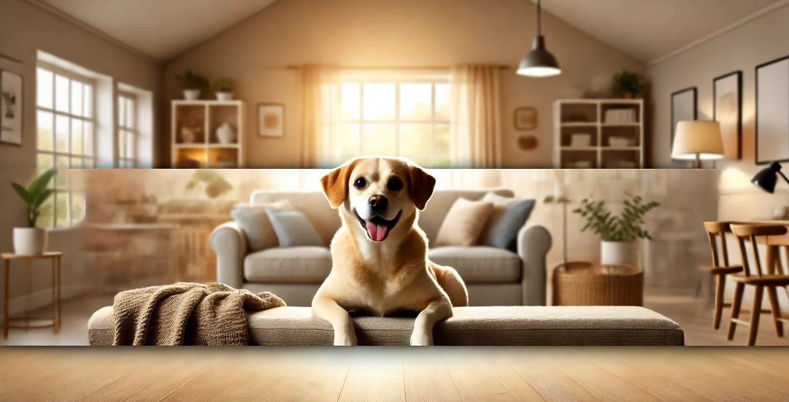

# Separation Anxiety: The Ultimate Guide to Separation Anxiety Rehabilitation and Prevention for Dogs

**By Sunny Luthra - OhMyDog.Rocks** 

  

## Introduction

Separation anxiety is a common behavioral problem affecting many domesticated dogs, leading to distress not only for the dog but also for the family and neighbors. Dogs suffering from separation anxiety may exhibit symptoms like destructive behavior, excessive barking, howling, or scratching when left alone.

This guide, **"The Ultimate Guide to Separation Anxiety Rehabilitation and Prevention for Dogs,"** is crafted to help dog parents understand the causes of separation anxiety and provides effective techniques for preventing and rehabilitating their dogs. Whether you're a new dog parent or dealing with an anxious dog, this guide will help you create a peaceful and harmonious environment for both you and your dog.

---

## Understanding Separation Anxiety

### Causes

Separation anxiety often arises from a lack of preparation for being alone. Dogs, in their natural habitat, rarely separate from their pack, making separation an unnatural and anxiety-inducing experience for them.

### Symptoms

- Destructive behavior (e.g., chewing, digging)
- Excessive barking, howling, or whining
- Scratching or digging at doors or windows
- Pacing or circling
- Loss of appetite
- Diarrhea or vomiting
- Indoor urination or defecation

These symptoms can vary from dog to dog and may also be indicative of other issues. It's essential to consult with a veterinarian or professional behaviorist to rule out other medical or behavioral concerns.

---

## Prevention Techniques

### 1. Building Confidence

Confidence-building is crucial in preventing separation anxiety. Regular socialization, exercise, and a consistent routine are key to raising a confident dog.

### 2. Creating a Structured Routine

A structured routine helps dogs feel secure. This routine should include:

- **Walk Ritual:** Regular walks at the same time daily for at least 30-60 minutes.
- **Discipline Ritual:** Training and discipline build a strong leader-follower bond.
- **Socializing Ritual:** Regular socialization with other dogs and people.
- **Feeding Ritual:** Consistent feeding times followed by rest.
- **Play Ritual:** Daily playtime to release energy.

### 3. Gradual Desensitization

Gradually increase the time your dog is left alone, starting with a few minutes and working up to longer periods.

### 4. Consistency and Patience

Consistency and patience are vital. These techniques should be implemented from the time you bring your dog home to prevent separation anxiety effectively.

---

## Rehabilitation Techniques

### Behavior Adjustments

- **Stop Nurturing Excitement:** Affection should be given when your dog is calm, not when they are excited or anxious.
- **Avoid Picking Up Your Dog:** Especially when stressed, as this reinforces nervous behavior.
- **Limit Constant Togetherness:** Allow your dog to experience alone time to build confidence.

### Steps for Separation Training

1. **Leash Time at Home:** Leash your dog during calm activities to get them used to being calm while restrained.
2. **Pretend to Leave:** Start by pretending to leave, and if your dog remains calm, gradually extend the duration.
3. **5-Second Rule:** Leave for 5 seconds, return, and remain calm, gradually increasing the time away.
4. **Repetition:** Continue the process, gradually increasing the duration, helping your dog learn that it's okay to be alone.

---

## Conclusion

Separation anxiety is common but preventable. By understanding triggers, providing a structured routine, gradually desensitizing your dog to being alone, and maintaining consistency, you can help your dog live a calm, confident life.

---

## What Next? (Get Personal Care Plan)

Start Your Journey to a Happier, Healthier Dog Today..

Checkout the personal care plan: [OhMyDog Care Plan](https://ohmydog.rocks/care)

---

**Thank You,**

**Sunny Luthra - OhMyDog.Rocks**  