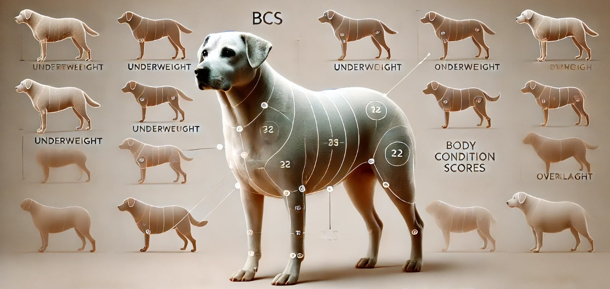

# The Essential Guide to Understanding Body Condition Scores

**By OhMyDog.Rocks**

---

## Introduction

Understanding your dog's body condition is crucial for their overall health and well-being. Body Condition Scores (BCS) are a practical tool that helps dog parents assess whether their dog is underweight, overweight, or at an ideal weight. This guide is designed to help you learn how to evaluate your dog's body condition and make informed decisions about their diet and exercise.

---

## What is a Body Condition Score?

A Body Condition Score (BCS) is a numerical scale that evaluates the amount of fat on your dog's body. The scale typically ranges from 1 to 9, with 1 being severely underweight and 9 being severely overweight. The ideal BCS for most dogs is between 4 and 5.

---

## Why is Body Condition Important?

Maintaining an ideal body condition is vital to your dog’s health. Overweight dogs are more susceptible to various health issues such as diabetes, joint problems, and heart disease. On the other hand, underweight dogs may suffer from malnutrition and decreased immune function. Monitoring your dog's BCS allows you to take early action and ensure your dog remains healthy and active.

---

## How to Assess Your Dog’s Body Condition

To assess your dog's body condition, you will need to perform both a visual and hands-on examination:

- **Rib Check:** Run your hands along your dog’s sides. You should be able to feel the ribs without pressing too hard. If the ribs are easily felt without excess fat covering, your dog is likely at an ideal weight.
  
- **Profile View:** Look at your dog from the side. An ideal weight dog will have a slight tuck-up (abdomen should be raised) behind the ribs.

- **Overhead View:** From above, your dog should have a visible waist behind the ribs. If the waist is not visible or if the sides bulge out, your dog may be overweight.

---

## Interpreting the Body Condition Score

- **BCS 1-3 (Underweight):** The dog’s ribs, spine, and pelvic bones are easily visible. There is little to no body fat, and there may be an apparent loss of muscle mass.

- **BCS 4-5 (Ideal):** The ribs are easily felt without a thick layer of fat covering them. The waist is clearly visible from above, and there is a slight abdominal tuck when viewed from the side.

- **BCS 6-9 (Overweight to Obese):** The ribs are difficult to feel under a thick layer of fat. The waist may not be visible, and there might be no abdominal tuck. In severe cases, the abdomen may appear distended.

---

## Tips for Maintaining an Ideal Body Condition

1. **Regular Exercise:** Ensure your dog gets regular physical activity appropriate for their breed and age. Activities can include walking, running, swimming, or playing fetch.

2. **Balanced Diet:** Feed your dog a balanced diet that meets their nutritional needs. Avoid giving too many treats and table scraps.

3. **Regular Check-ups:** Regular veterinary visits are essential for monitoring your dog’s health and body condition.

4. **Adjust Feeding Amounts:** If your dog is gaining or losing weight, adjust their food intake accordingly. Consult with your vet for specific feeding recommendations.

---

## Conclusion

Maintaining an ideal body condition score is essential for your dog’s health and longevity. By regularly assessing your dog's BCS and making necessary adjustments to their diet and exercise routine, you can help ensure they live a long, healthy, and happy life.

---

## What Next? (Get Personal Care Plan)

Start Your Journey to a Happier, Healthier Dog Today..

Checkout the personal care plan: [OhMyDog Care Plan](https://ohmydog.rocks/care)

---

**Thank You,**

**OhMyDog.Rocks Team** 