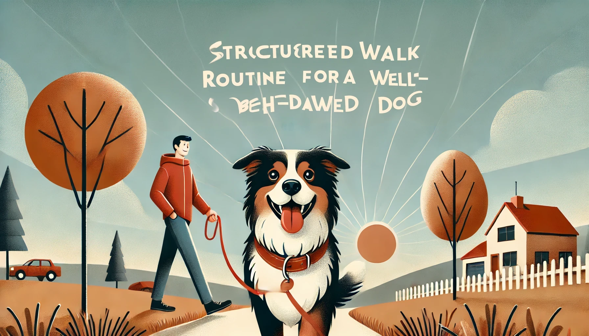

## Step-by-Step Guide to a Structured Dog Walk Routine

### 1. **Begin a Structured Walk Routine**
   - **Frequency:** Take your dog on a structured walk **twice a day**.
   - **Duration:** Each walk should last between **30 to 45 minutes**.

### 2. **Set a Fixed Walk Schedule**
   - **Consistency:** Walk your dog at the **same time every day**. This helps create a routine that your dog can anticipate and rely on.

### 3. **Walk at a Brisk Pace**
   - **Speed:** Aim to walk at a pace that is **1.5 to 1.7 times** your normal walking speed. This helps burn off your dog's energy more effectively.

### 4. **Follow a Structured Walk Pattern**
   - **Breaks:** Walk for **15 minutes**, then allow your dog a **2-5 minute break**. Repeat this cycle **2-3 times** during each walk. This structure helps in teaching your dog discipline while keeping the walk engaging.

### 5. **End the Walk with Calm Behavior**
   - **At Home:** Conclude the walk by having your dog **sit outside the gate of your house** while on a leash.
   - **Calmness:** Wait for your dog to become calm before bringing them inside. This reinforces calm behavior as the walk concludes.

### 6. **Create a Resting Place at Home**
   - **Designated Area:** Set up a **secluded spot** in your home where your dog can relax. This should be in a quiet corner and may be partially covered to create a sense of security.
  
### 7. **End the Walk with a Relaxing Activity**
   - **Leash at Resting Spot:** Once home, lead your dog to their designated resting spot and keep them leashed there.
   - **Chew Time:** Give your dog a **natural bone** to chew on for **10-15 minutes**. This serves as a reward and helps them unwind after the walk.
   - **Unleash:** After the chew time, you can unleash your dog to relax fully.

### 8. **Maintain Consistency**
   - **21-Day Rule:** Be consistent with this routine for **21 days**. Consistency is key to seeing significant improvements in your dog's behavior.

## Why This Routine Works

Structured walks are more than just exercise—they are an essential part of your dog’s mental and physical well-being. Here’s why this routine is effective:

1. **Burns Excess Energy:**
   - By increasing the pace and structuring the walk with intervals, your dog expends more energy, reducing the likelihood of hyperactivity or destructive behavior at home.

2. **Promotes Mental Stimulation:**
   - A fixed schedule and structured walk pattern provide mental challenges that keep your dog engaged. Dogs thrive on routine, and this predictability helps them feel secure and calm.

3. **Reinforces Discipline and Obedience:**
   - The structured approach teaches your dog to follow your lead, wait patiently during breaks, and remain calm before re-entering the house. These small but consistent practices contribute to overall better behavior.

4. **Supports Rest and Recovery:**
   - Ending the walk with a period of calmness and a relaxing activity like chewing on a natural bone allows your dog to transition smoothly from physical exertion to rest. This not only helps in calming them down but also encourages a healthy routine of activity followed by relaxation.

## Tips for Success

- **Stay Calm and Consistent:** Your dog takes cues from your behavior. If you remain calm and assertive during the walks, your dog is more likely to mirror that behavior.
- **Be Patient:** It might take a few days for your dog to adjust to this new routine. Consistency is

## 6 Structured Walk Ideas for Your Dog

### 1. **Interval Walking**
   - **Structure:** Walk at a brisk pace for 5 minutes, then slow down for 2 minutes. Repeat this cycle for the entire duration of the walk.
   - **Purpose:** This variation helps in keeping your dog engaged and focused while providing a mix of physical exertion and recovery.

### 2. **Obedience Walk**
   - **Structure:** During the walk, every 5-10 minutes, stop and ask your dog to perform basic obedience commands like "sit," "stay," or "heel." Continue walking only after the command is successfully completed.
   - **Purpose:** Reinforces obedience training in a real-world environment, helping your dog stay focused on you during the walk.

### 3. **Exploration and Focus**
   - **Structure:** Allow your dog to explore a designated area (like a park or trail) for 5 minutes, then call them back to walk by your side for 10 minutes. Repeat this pattern throughout the walk.
   - **Purpose:** Balances your dog’s natural curiosity with the discipline of walking calmly by your side.

### 4. **Pace Variation Walk**
   - **Structure:** Start the walk at a normal pace, then increase to a brisk walk for 10 minutes, slow down to a casual pace for 5 minutes, and then repeat. Include a few short jogs if possible.
   - **Purpose:** Varies the intensity of the walk, helping to build your dog’s stamina while also keeping the walk interesting.

### 5. **Directional Change Walk**
   - **Structure:** Every few minutes, change direction abruptly and encourage your dog to follow your lead without pulling or lagging behind. Use commands like "this way" or "turn" to signal the change.
   - **Purpose:** Helps improve your dog's attentiveness and responsiveness to your cues, reducing the likelihood of pulling on the leash.

### 6. **Distance Markers Walk**
   - **Structure:** Pick landmarks (like trees, benches, or lampposts) and walk briskly to one, then slow down as you approach the next one. Use different markers throughout the walk to change the pace frequently.
   - **Purpose:** Adds variety to the walk and teaches your dog to adjust their pace in response to your movement.

These structured walk ideas can be easily adapted to your dog's needs and environment, providing mental and physical stimulation while reinforcing good behavior.

---

## What Next? (Get Personal Care Plan)

Start Your Journey to a Happier, Healthier Dog Today..

Checkout the personal care plan: [OhMyDog Care Plan](https://ohmydog.rocks/care)

---