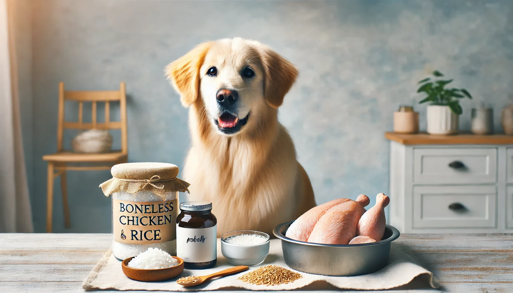

## Managing Your Dog's Yeast-Induced Skin Allergies Through Intermittent Fasting and Elimination Diet

If your dog is struggling with skin allergies caused by yeast overgrowth, managing their diet can be a crucial part of the solution. Implementing an intermittent fasting routine combined with an elimination diet focused on a single protein source, such as lean boneless chicken and white rice, can help alleviate symptoms and promote overall health.

### Why Intermittent Fasting?

Intermittent fasting is beneficial for dogs, especially those with yeast-related issues. By limiting your dog’s eating window to two meals a day, you can trigger a process called **autophagy**. This natural process helps the dog’s body recycle dead cells, microbes, fungi, and viruses into raw materials for new cells. Not only does this support detoxification, but it also facilitates weight loss, which is vital if your dog is overweight.

### Enhancing the Diet: Adding Probelly and Coconut Oil

To further support your dog’s health during this regimen, consider adding **probelly** (a probiotic supplement) and **edible coconut oil** to their meals once a day. Probiotics help maintain a healthy gut flora, which can be beneficial in controlling yeast overgrowth. Coconut oil has antifungal properties and can soothe your dog's skin from the inside out. However, other than probelly and coconut oil, the meal should strictly consist of only boneless chicken and white rice.

### Implementing the Feeding Schedule

To ensure the success of this approach, it’s essential to strictly adhere to a feeding schedule. Your dog should have two meals a day, with no daily treats, especially if they are overweight. The time window between the two meals should be under six hours. For instance, if your dog eats the first meal at 1:00 pm, the second meal should be provided before or at 6:00 pm.

## Step-by-Step Guide: Managing Yeast-Induced Skin Allergies in Dogs

If your dog is suffering from yeast-induced skin allergies, implementing a structured diet plan can be an effective way to manage the condition. This guide will walk you through the process of setting up an intermittent fasting schedule and an elimination diet using boneless chicken, white rice, probelly (a probiotic supplement), and edible coconut oil.

### Step 1: Understand the Basics

- **Yeast-Induced Skin Allergies**: These occur when there is an overgrowth of yeast on your dog’s skin, causing itching, redness, and irritation.
- **Intermittent Fasting**: This involves feeding your dog two meals a day within a six-hour window. The goal is to trigger autophagy, a natural process that helps the body cleanse itself by recycling dead cells, microbes, and fungi.
- **Elimination Diet**: This diet includes only boneless chicken and white rice, with the addition of probelly and coconut oil. This helps identify food allergens that may contribute to the yeast overgrowth.

### Step 2: Family Meeting

- **Discuss the Plan**: Gather all family members and explain the new feeding regimen. Consistency is crucial for success, so everyone needs to be on the same page.
- **No Treats**: Inform everyone that treats should be avoided until the dog reaches their optimal weight. This includes no snacks between meals.

### Step 3: Set Up the Feeding Schedule

- **Two Meals a Day**: Your dog should eat two main meals a day, with the time window between them being less than six hours. For example, if the first meal is at 1:00 pm, the second meal should be given before or at 6:00 pm. This helps ensure the benefits of intermittent fasting, including the promotion of autophagy.

- **Meal Composition**: Each meal should consist strictly of boneless chicken and white rice. Additionally, include **probelly** (a probiotic supplement) and **edible coconut oil** once a day to support gut health and manage yeast overgrowth.

### Step 4: Gradually Transition to Two Meals

If your dog is currently eating more than two meals a day, follow these steps to gradually transition:

1. **Delay Meals**: Start by delaying each meal by 15 minutes every day. Continue this until you can merge multiple meals into just two meals within a six-hour window.
   
2. **Eliminate Snacks**: Remove all snacks and treats between meals. This will help your dog adjust to the new feeding schedule and avoid disruptions in the fasting period.

3. **Shorten the Meal Window**: If you are already feeding two meals a day, work on shortening the interval between them. Delay the first meal by 15 minutes and advance the second meal by 15 minutes each day until the meals are within six hours of each other.

### Step 5: Establish a Fixed Routine

- **Consistency is Key**: Stick to the new feeding times every day. Dogs thrive on routine, and a consistent schedule will make it easier for them to adjust.
  
- **Meal Timing**: If your dog is not interested in eating at the designated time, remove the food bowl after five minutes. Don’t worry—offer the meal again at the next scheduled time.

### Step 6: Monitor Progress

- **Watch for Improvements**: Look for signs that the diet and fasting schedule are working. This includes reduced itching, redness, and skin irritation. Weight loss, if your dog was overweight, is also a positive sign.
  
- **Consult with an Expert**: If you don’t see improvement after several weeks, or if your dog’s condition worsens, consult with an expert. They can help identify any other potential issues or adjust the diet as needed.

### Step 7: Reintroduce Foods Slowly

After 8-12 weeks on the elimination diet:

1. **Reintroduce Foods Gradually**: Introduce new foods one at a time, in small amounts. This will help you identify any potential allergens that could be triggering the yeast overgrowth.

2. **Monitor Reactions**: Keep a close eye on your dog’s reaction to the new foods. If symptoms return, remove the new food and consult with an expert.

## Final Thoughts

Managing yeast-induced skin allergies in dogs requires patience and consistency. By following this step-by-step guide, you can help alleviate your dog’s symptoms and improve their overall health. Remember, every dog is unique, so it’s important to observe how your dog responds to these changes and make adjustments as needed.

## FAQs: Managing Your Dog's Yeast-Induced Skin Allergies

**Q1: What is yeast-induced skin allergy in dogs?**
- **A1:** Yeast-induced skin allergy occurs when there is an overgrowth of yeast on your dog’s skin, leading to itching, redness, and irritation. It often appears in areas such as the ears, paws, and folds of the skin.

**Q2: How does intermittent fasting help with yeast-induced skin allergies?**
- **A2:** Intermittent fasting can help by triggering autophagy, a process that aids in recycling dead cells, microbes, and fungi, including yeast. This reduces the yeast overgrowth and supports overall skin health.

**Q3: Why is an elimination diet recommended for dogs with yeast allergies?**
- **A3:** An elimination diet helps identify potential food allergens that could be contributing to the yeast overgrowth. By feeding your dog a single protein source like lean boneless chicken and a simple carbohydrate like white rice, you can reduce inflammatory responses and improve skin condition.

**Q4: How long should I keep my dog on an elimination diet?**
- **A4:** An elimination diet should typically be followed for 8-12 weeks. After this period, you can gradually reintroduce other foods while monitoring your dog’s reaction to identify any triggers.

**Q5: Can I give my dog treats during this dietary regimen?**
- **A5:** During the initial phase, it's recommended to avoid giving your dog treats, especially if they are overweight. Treats can disrupt the fasting period and may contain ingredients that exacerbate yeast growth.

**Q6: How do I know if intermittent fasting and the elimination diet are working?**
- **A6:** Improvement in your dog’s symptoms, such as reduced itching, redness, and skin irritation, indicates that the regimen is working. You should also notice overall better health and, in some cases, weight loss if your dog was overweight.

**Q7: What should I do if my dog refuses to eat the prescribed meals?**
- **A7:** If your dog is not interested in eating, remove the food bowl after five minutes and offer it again at the next scheduled meal time. This will help establish a routine and encourage your dog to eat during the designated meal windows.

**Q8: Can I use this approach if my dog has other health conditions?**
- **A8:** Before starting intermittent fasting or an elimination diet, it’s important to consult with an expert, especially if your dog has other health issues. This will ensure that the approach is safe and suitable for your dog’s specific needs.

**Q9: Is it safe to keep my dog on intermittent fasting long-term?**
- **A9:** Intermittent fasting can be safe and beneficial long-term if done correctly. However, it’s essential to monitor your dog’s health and adjust the feeding schedule as needed. Regular check-ups with an expert are recommended to ensure your dog remains healthy.

**Q10: What if my dog's symptoms don't improve?**
- **A10:** If your dog's symptoms do not improve after several weeks on this regimen, it may be necessary to consult with an expert for further evaluation. They can help determine if other underlying issues might be contributing to the skin allergies.

**Q11: How do probelly and coconut oil help in managing yeast-induced skin allergies?**
- **A11:** Probelly, a probiotic supplement, helps maintain a healthy gut flora, which is crucial for controlling yeast overgrowth. Coconut oil, with its antifungal properties, can soothe your dog’s skin from the inside out. Adding these to your dog’s meal once daily can enhance the effectiveness of the intermittent fasting and elimination diet approach.

**Q12: Can I add anything else to my dog's meals besides boneless chicken, rice, probelly, and coconut oil?**
- **A12:** During the elimination diet phase, it is crucial to keep your dog’s meals simple and consistent. Other than probelly and edible coconut oil, the meals should consist strictly of boneless chicken and white rice. This helps in accurately identifying any food-related triggers for the yeast overgrowth.

---

This content provides a comprehensive guide for dog parents looking to manage yeast-induced skin allergies through intermittent fasting, an elimination diet, and supplemental support with probelly and coconut oil. By following these steps and keeping the FAQs in mind, you can help your dog achieve better health and comfort.

