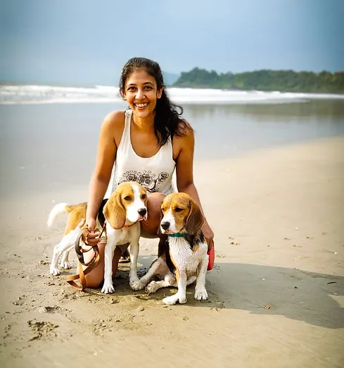

# Shivani Kale: Embracing Natural Healing for Pets

## Introduction

Shivani Kale has always been deeply connected to natural healing practices. Growing up surrounded by these traditions, it was only natural that she would seek the same for her beloved dogs, Walnut and Donut—affectionately known as "The Nutpack."

## A Journey into Nature's Healing Powers

Living in a small village in Goa, Shivani was constantly in awe of the local community's knowledge of natural remedies. Surrounded by wilderness, she observed how the locals would forage for plants to heal themselves and their animals. This deep connection with nature ignited a passion within her—a passion that led her to explore the world of Applied Zoopharmacognosy.

## Learning and Sharing the Power of Botanicals

Shivani's journey took her to study under Caroline Ingraham, a pioneer in Applied Zoopharmacognosy. Through her studies, she discovered the incredible power of botanicals and began formulating her own blends for her dogs. She witnessed firsthand how these natural remedies worked wonders, and this success sparked a desire to share her knowledge with the broader pet community. Recognizing the transformative potential of self-selection and self-medication in animals, Shivani knew she had to spread this wisdom.

## The Birth of NUTKIT

This passion and dedication led to the creation of **NUTKIT**—a unique collection of safe, natural remedies designed specifically for pets. NUTKIT allows animals to engage their natural instincts, guiding them to select the remedies they need, all within a calm and voluntary healing environment.

With the launch of [nutkit.co.in](http://nutkit.co.in), Shivani aspires to enlighten pet parents about the power of self-selection and self-medication. Her mission is to create a non-stressful, voluntary healing space where pets can thrive naturally, just as nature intended.

## Conclusion

Shivani Kale's journey from observing traditional healing methods in a small Goan village to becoming an expert in Applied Zoopharmacognosy is a testament to her commitment to natural pet care. Through NUTKIT, she continues to share the magic of botanicals, empowering pet parents to trust in their animals' instincts and the healing power of nature.

Visit [nutkit.co.in](http://nutkit.co.in) to learn more about Shivani's work and discover how you can create a natural healing space for your pets.
