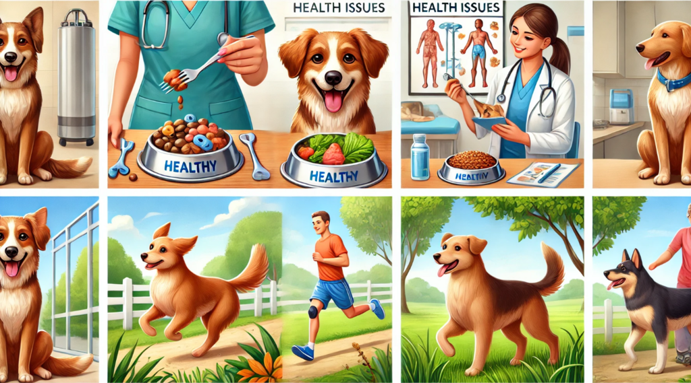
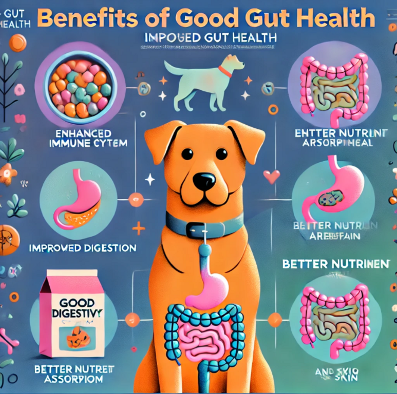

# Welcome to the OhMyDog Educational Portal

Welcome to the OhMyDog Educational Portal, your go-to resource for everything you need to know about your dog's health and well-being. We understand that being a dog parent is both a joy and a responsibility, and we're here to support you every step of the way.

## What You'll Find Here

Our portal is designed to provide you with comprehensive, easy-to-understand information on a wide range of topics related to your dog's health and behavior. Whether you're dealing with a specific issue or just looking to expand your knowledge, we've got you covered.

## Topics We Cover
### Health Issues

- Digestive Problems (vomiting, loose stool, etc.)
- Skin Allergies
- Obesity
- Joint Health
- Kidney Issues
- Diabetes
- Tumors and Cancers
- Liver Problems
- Tick Fever
- Appetite Issues

### Behavioral Challenges

- Puppy Training (biting, pee/poop training, hyperactivity)
- Adult Dog Behavior (separation anxiety, leash pulling, aggression, etc.)

### Gut Health with Pro Belly

- Importance of Gut Health
- How Pro Belly Works
- 90 Days Gut Challenge

### Personal Care Plans
- Custom Care Plans for Your Dog
- How to Enroll
- Topics Covered

### Community and Support
- Join Our Super Cool Chat Community
- Benefits of Being in a Community
- How to Use the Community
- Success Stories

### Professional Resources
- Courses for Dog Care Professionals
- Free and Paid Learning Opportunities
- Mentorship Programs

## How to Use This Portal

Explore the topics that interest you by navigating through our well-organized sections. Each section is filled with valuable information, practical tips, and resources to help you ensure the best care for your dog.

## Join Our Community

Don't forget to join our chat community, where you can connect with other dog parents, share your experiences, and get advice from experts. Together, we can create a supportive and knowledgeable network for all dog parents.

## Our Commitment

At OhMyDog, we are committed to helping you become the best dog parent you can be. We continuously update our content to bring you the latest information and best practices in dog care.

Thank you for being a part of our community. We are excited to embark on this journey with you and your beloved dogs!
